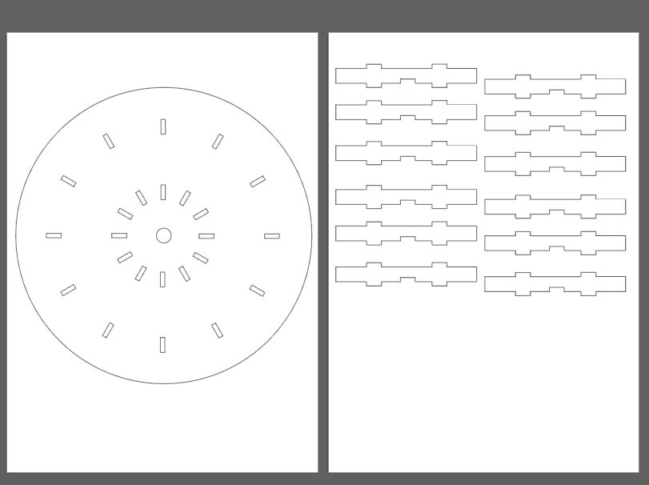

# Watch Dust! Project
미세먼지 어플을 시간마다 활용하는 사용자는 많지 않다. 대부분의 사용자는 아침 혹은 외출하기 전, 마스크와 같은 대비책을 마련해야 하는지에 대한 결정을 하기위해 하루의 전체적인 미세먼지 농도를 확인하고 싶어한다. 하지만, 기존의 미세먼지 어플은 하루의 미세먼지 농도를 전체적으로 알 수 있게 하기보다는 현재 시각의 미세먼지에만 초점을 맞추고 있어 사용자의 니즈를 달성하기에는 한계가 있다. 이러한 사용자의 필요를 충족시키기 위해 하루의 전체적인 미세먼지 농도를 쉽고 빠르게 인지할 수 있도록 시각화하여 사용자들이 미세먼지 예방책을 마련할 수 있도록 하는 것이 우리 Watch Dust! 프로젝트의 목표이다. 즉, Watch Dust!프로젝트는 Design for Simplicity, Design for Ease of Use를 중심으로 복잡한 사용 방법, 혹은 24㎍/㎥(1h)와 같은 정확한 미세먼지 측정량과 같이 일반 사용자에게는 어렵고 불필요한 세세한 데이터를 배제하여 남녀노소 누구나 인지적인 스트레스가 크지 않고 무리없이 사용 가능하다. 이에 따라 사용자는 직관적으로 하루의 미세먼지 농도 정보를 얻을 수 있으며, 다른 미세먼지 알림 제품, 서비스와는 차별적으로 편리성, 직관성, 쉬움 등의 가치를 얻게 된다.


## 1. Watch Dust's Hardware Product
### 1.1 Concept
Watch Dust! 프로젝트의 제품은 가정용 미세먼지 시계를 컨셉으로 제작된다. 미세먼지 시계란 다음 사진과 같이 동그란 아날로그 시계 테두리에 각 시간에 따라 미세먼지 농도 변화를 색상으로 표현해줄 수 있는 LED를 달아 사용자가 시각적으로 하루의 미세먼지 농도를 지각하게 하는 것에 초점을 둔다. 하루의 미세먼지 농도를 종합적으로 시각화하기 위해서는 시계와 결합하는 것이 어떨까라는 아이디어에서 시작하였다. 시계 중에서도 디지털 시계가 아닌 아날로그 시계를 택한 이유는 Design for Simplicity, Ease of Use를 실천하기 위해 디지털 기기에 생소한 사용자들도 편리하게 사용할 수 있기 때문이다. 또한, LED를 통해 조명으로 미세먼지를 표현하면서 디지털 화면을 보여준다면 사용자의 눈에 피로가 가서 장기간 사용하기에 무리가 있다고 판단되어 다음과 같은 결정을 하였다. 


### 1.2 How To Develop
제품을 제작하기 위해서 아크릴 판과 나무판을 레이저 커팅하여 아날로그 시계 구조를 제작하였으며, 시계 침과 초는 따로 구매하였다.
다음은 레이저 커팅 도면과 실제 커팅을 한 후 모습이다.



센서를 활용하기 위해 라즈베리 파이, 시계에 미세먼지 농도에 따라 빛으로 표현하게 하는 LED를 사용하였다. 시계의 센서를 통해 미세먼지 농도 정보를 받아들이고 현재 시각 이후의 농도는 미세먼지 예측 데이터를 에어코리아, 국가정보관리원과 같은 사이트에서 제공하는 데이터를 받아 대기의 상태를 매우 나쁨/나쁨/보통/좋음으로 나누어 다르게 표현할 예정이었다. LED의 색상은 농도에 따라 매우 나쁨(빨강), 나쁨(노랑), 보통(초록), 좋음(파랑)으로 나누어 표현하였다. LED는 빵판과 선을 이용하여 라즈베리 파이에 연결하였다. 
Markdown is a lightweight and easy-to-use syntax for styling your writing. It includes conventions for

```markdown
Syntax highlighted code block

# Header 1
## Header 2
### Header 3

- Bulleted
- List

1. Numbered
2. List

**Bold** and _Italic_ and `Code` text

[Link](url) and 
```

For more details see [GitHub Flavored Markdown](https://guides.github.com/features/mastering-markdown/).

### Jekyll Themes

Your Pages site will use the layout and styles from the Jekyll theme you have selected in your [repository settings](https://github.com/jimin030/Watch_Out_Project/settings). The name of this theme is saved in the Jekyll `_config.yml` configuration file.

### Support or Contact

Having trouble with Pages? Check out our [documentation](https://help.github.com/categories/github-pages-basics/) or [contact support](https://github.com/contact) and we’ll help you sort it out.

